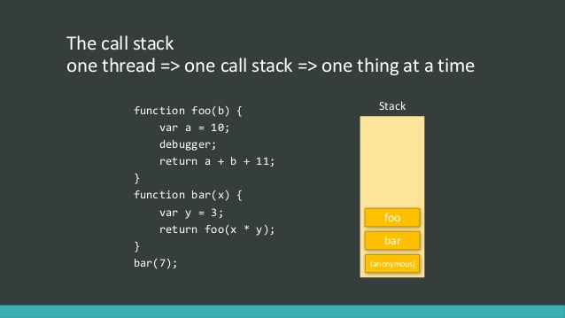

# Behind the Scenes & The (Weird) Past (ES3, ES5) & Present (ES6+) of JavaScript

- ES stands for **E**CMA**S**cript. Over time, ECMAScript and therefore **JavaScript** evolved, it dates back into the 90s of course when it got started.
- ES6 was a major mark in development of **JavaScript**. Many new features added that help us to write cleaner, better, and faster code. **JavaScript** is still under active development, but ES6 was a big step step forward.
- All the modern browsers (includes Edge) have an auto updating functionality which means people don't have to manually install new browser versions, which was the case with older versions of Internet Explorer and therefor features can be integrated into browsers at a much faster pace and more and more users will automatically use these latest versions of browsers, because the browsers themselves automatically update, so that's really cool.
- If you declare two or more variables with the same name using `var` (pre-ES6), the latest variable will override all previous ones. For example:

    ```js
    var name = "Hamed";
    var name = "Hamid";
    var name = "Ali";

    console.log(name); // Ali
    ```

    As of ES6, if you try this with `let` keyword (or `const`), you will get an error. For example:

    ```js
    let name = "Hamed";
    let name = "Hamid"; // error happens here
    let name = "Ali";

    console.log(name); // SyntaxError: Identifier 'name' has already been declared
    ```

- In **JavaScript** with `let` and `const` you can define variables or constants in global scope or local scope (block scope) and use them in their own scope. But with `var`, (pre-ES6) variables are accessible entire the function scope. In other words, `var` only knows global scope and function scope, but `let` and `const` knows curly braces (blocks). For example:

    ```js
    // with `var`
    function greet() {
        if (true) {
            var name = "Hamed";
        }
        console.log("Hello " + name);
    }

    greet(); // Hello Hamed
    ```

    As of ES6, you can use `let` and `const` for block scoping:

    ```js
    function greet() {
        if (true) {
            let name = "Hamed";
            const AGE = 23;
        }
        console.log("Hello " + name, age);
    }

    greet(); // ReferenceError: name is not defined
    ```

    So **don't** use `var` anymore.

- In **JavaScript**, if you have a global variable and a local variable with the same name (or constants), **JavaScript Engine** will look at the nearest variable and take its value. It's called **shadowing**. For example:

    ```js
    let name = "Ali";

    function greet() {
        let name = "Hamed";
        console.log("Hello " + name);
    }

    greet(); // Hello Hamed
    ```

- **JavaScript** has a special feature called **hoisting** which means that the **JavaScript Engine** declares the variables (also functions) first, then initialize them. So if you try to define some variables after their calls, you will get `undefined` value. Consider:

    ```js
    console.log(name); // undefined

    var name = "Hamed"
    ```

    Why? because **JavaScript Engine** will interprets this snippet like this:

    ```js
    var name;

    console.log(name); // undefined
    name = "Hamed";
    ```

    But with `let` and `const`, **JavaScript** will force you to write cleaner and understandable code. So the **JavaScript Engine** throws an error if you try to hoisting variables (or constants) with `let` and `const`. For example:

    ```js
    console.log(name); // ReferenceError: Cannot access 'name' before initialization

    let name = "Hamed";
    ```

    It's good to take advantage of this feature for functions. For example:

    ```js
    greet("Hamed");

    function greet(name) {
        console.log(name);
    }
    ```

- In **JavaScript** you can declare a variable without any keyword (`var`, `let`, and `cosnt`). For example:

    ```js
    name = "Hamed";

    console.log(name);
    ```

    But **don't** do that. As of ES5, **JavaScript** added a new feature called **strict mode** for super safe code purpose. To use that, you should put `"use strict"` string wherever you want. For example:

    ```js
    "use strict"

    name = "Hamed";

    console.log(name); // ReferenceError: name is not defined
    ```

    You're not allowed to declare a variable (or constant) with reserved word in strict mode. For example:

    ```js
    "use strict"

    let const = 10; // SyntaxError: Unexpected strict mode reserved word
    ```

- In **JavaScript** the **interpreter** basically loads our script, reads it, then translates it to byte code which is a bit easier to execute, then it goes ahead and starts running our script (line-by-line). The interpreter does not just start executing your script, it also hands off the bye code to the **compiler** (JiT). So the compiler, whilst the interpreter already started execution of your script, now compiles the script to **machine code**. That's then the fast possible way of executing the script.
- In **JavaScript Engine**, there are two concepts for executing the code: **Heap** and **Stack**. If you define some functions, **JavaScript** then registers them (you could say it stores them) in the Heap, because functions have a long life typically. Then the browser in the end pushes stuff into our Stack (Stack is basically our short term memory and Heap is the long term memory). The Stack is simply populated by pushing new function calls or new short living data on top of its specific function (`(anonymous)`) and popping it off when it's not required anymore (after the execution done, `(anonymous)` will popped off). For example:

    

- **JavaScript** is single thread. It means the **JavaScript** can only do one thing at a time. For example it call one function at a time and the other functions waited for the response of that function (in Stack).
- In **JavaScript** we have two important categories of types: **Primitive** and **Reference**. You can see the list of primitive values below:
  - Strings
  - Numbers
  - Booleans
  - `null`
  - `undefined`
  - `Symbol`

  And all objects are reference values.
- Every number that you create and which you then store in a variable or which you use in a calculation is created by **JavaScript** or by the browser behind the scenes as a **primitive** value. It's stored in memory, normally on the stack, because normally these are relatively short living, because **JavaScript** can get rid of them relatively easy. So primitive values typically are stored in the Stack. You copy a value, which means you assign it to a new one which holds a primitive value, then the value is actually copied. For example:

    ```js
    let firstName = "Hamed";
    let secondName = name;

    firstName = "Ali";
    console.log(firstName); // Ali
    console.log(secondName); // Hamed
    ```

    But objects are handled differently, because they're more expensive to create. In that case, a variable only stores a pointer, so the address of that place in memory (Heap) and not the value itself (or simply: A **reference** to the object stored in memory (hence **reference values**)). Therefore if you copy a variable which holds a reference value, you only copy the pointer (the reference) and not the value itself. For example:

    ```js
    let hobbies = ["Sports"];
    let newHobbies = hobbies;

    hobbies.push("Cooking");
    console.log(hobbies); // ["Sports", "Cooking"]
    console.log(newHobbies); // ["Sports", "Cooking"]
    ```

    But you can copy objects with a tricky (hacky) way with **spread** operator. For example:

    ```js
    let person = { age: 30 };
    let anotherPerson = person;

    anotherPerson.age = 32;
    console.log(person); // {age: 32}

    let yetAnotherPerson = { ...person };

    person.age = 30;
    console.log(yetAnotherPerson); // {age: 32}
    ```

    So if you even have two object with the same value, the comparison of them always returns `false` (with `==` or `===`). Because each of them, stores their value in the memory separately. For example:

    ```js
    const person1 = { age: 30 };
    const person2 = { age: 30 };

    console.log(person1 == person2); // false
    console.log(person1 === person2); // false
    ```

- Consider this constant:

    ```js
    const hobbies = ["Sports"];

    hobbies.push("Cooking");
    console.log(hobbies); // ["Sports", "Cooking"]
    hobbies = ["Sports", "Running"]; // Uncaught TypeError: Assignment to constant variable.
    ```

    The `["Sports"]` array gets created somewhere in memory and `hobbies` gets the address of the array (or an object), so the address is getting stored in this constant. When we call `push(..)`, we certainly do manipulate the data in memory. But what do we not manipulate? the address. If you try to assign a new array to this constant, you will get an error, because you're going to change its address and `const` doesn't allow this behavior. Now of course, you can't change primitives stored in constants, because these are not stored in memory and there is no address stored in the constant, but instead the real value is stored in it.
- The **JavaScript garbage collector** periodically checks the heap memory for unused objects (objects without references). Therefore the garbage collector will go ahead and basically remove (clear) all unused objects from the memory (from the heap memory). So all the objects where garbage collector sees that you certainly won't work with them anymore will be removed from the memory. Consider:

    ```js
    let person = { name: "Max" };

    person = null;
    ```

    In this snippet, if you execute the script, the garbage collector will remove the `person` object from the memory, because it's an unused obejct. In modern browsers (e.g. Chrome, Firefox, etc), you don't have to set `null` to the objects. If you're not using these variables anymore in any place of your script (which you stored them in `let` or `const`), they can be cleaned up by modern browsers with modern **JavaScript Engines**.
- Beware of **memory leaks** in you **JavaScript** program. Consider:

    ```js
    function addListener() {
        clickableBtn.addEventListener("click", function () {
            const value = messageInput.value;
            console.log(value || "Clicked me!");
        });
    }

    addListenerBtn.addEventListener("click", addListener);
    ```

    If you click on `ClickableBtn` 10 times (for example), 10 new functions will registers in the memory. So when you click on `addListenerBtn`, you will get 10 inputs instead of one. This is the definition of memory leak. You can fix (memory leak) the previous snippet like this:

    ```js
    function printMessage() {
        const value = messageInput.value;
        console.log(value || "Clicked me!");
    }

    function addListener() {
        clickableBtn.addEventListener("click", printMessage);
    }

    addListenerBtn.addEventListener("click", addListener);
    ```
