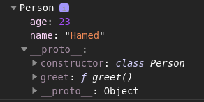

# Deep Dive Constructor Functions & Prototypes

- You can use the constructor with objects as you can use it in the class (because in the end, in **JavaScript**, classes are just objects). Consider:

    ```js
    function Person() {
        this.age = 23;
        this.name = "Hamed";
        this.greet = function () {
            console.log("Hi, I am " + this.name + " and I am " + this.age + " years old.");
        }
    }

    const person = new Person();

    person.greet(); // Hi, I am Hamed and I am 23 years old.
    ```

    The `new` keyword here adds all the properties and methods behind the scene to an empty object and then it returns this object. Like this:

    ```js
    function Person() {
        this = {/*Properties and Methods*/};
        // ...
        return this;
    }

    const person = new Person();
    ```

- **JavaScript** is a prototype-based language which use prototypical inheritance.
- Every constructor function you build has a special prototype property which is not added to the object you create based on it, because it's not part of the function body.
- A prototype is an object itself. Every object in **JavaScript** has a prototype and a prototype is basically a connected object which is used as a fallback object. If **JavaScript** tries to access a certain method or property and doesn't find it on an object, it automatically looks at the prototype object and looks for the property there and if it doesn't find it there, it looks at the prototype of the prototype (all the way until it reaches the end of that chain). If **JavaScript** didn't find that property or method anywhere, for a property it would return `undefined` and for a method it would throw an error.
- The `__proto__` property is present on every object in **JavaScript** :
  - No matter how you created it.
  - No matter if that is a function object or a function object which we use as a constructor function.
  - No matter if that is an object you build with object literal notation or an object you build with the help of a constructor function.
  - No matter if that is an array.
  
  It (`__proto__`) shows you the connected prototype (or backup object). For example:

  ```js
  class Person {
      name = "Hamed";
      age = 23;
  }

  const p = new Person();
  const p2 = new p.__proto__.constructor();

  console.log(p2); // Person { name: 'Hamed', age: 23 }
  ```

  In Here, the `constructor` function refers to the `Person` constructor function. So you could create more objects of that type.
- In **JavaScript**, the `Object` is a constructor function with a bunch of built-in properties or methods you can call. But it's not the fallback object of everything. For example:

    ```js
  class Person {
      name = "Hamed";
      age = 23;
  }

  const p = new Person();

  console.log(p.length); // undefined
    ```

    There is `Object.length` property. But as you can see the `Object` is not the fallback object of everything. Instead, the fallback value of all objects is `Object.prototype`, because the `prototype` property exists on everything which is a constructor and `Object` is just such a constructor function in the end.
- The objects prototype chain ends at `Object.prototype`.
- If you create a method in a class, that method will be stored in `__proto__`. So **JavaScript** adds a little optimization for us. By adding the method to a prototype, it makes sure that when ever we create a new instance of that object, we use the same prototype fallback object. It's a little optimization which leads to less objects being created, which means less memory usage and of course less performance (because creating objects costs performance). For example:

    ```js
    class Person {
        name = "Hamed";
        age = 23;

        greet() {
            console.log(`Hello ${this.name}`);
        }
    }

    const p = new Person();
    const p2 = new Person();

    p.greet(); // Hello Hamed
    console.log(p.__proto__ === p2.__proto__); // true
    console.log(p); // Person { name: 'Hamed', age: 23 }
    console.dir(p); // === See in the image below ===
    ```

    

    Therefore, if you create for example 1000 times of `Person` instance, all of them just have one reference to `greet` method (not 1000x). It's equivalent if you would build it on your own using `prototype` object. For example:

    ```js
    function Person() {
        this.name = "Hamed";
        this.age = 23;
    }

    Person.prototype.greet = function () {
        console.log(`Hello ${this.name}`);
    }

    const p = new Person();

    p.greet(); // Hello Hamed
    ```

- It's better to **not** assign a method to a field in a class (or in `constrcutor` function). So always use that `someMehtod() {..}` syntax (method shorthand or concise method). Consider:

    ```js
    class Person {
        name = "Hamed";
        age = 23;

        constructor() {
            // this.greet = function () {
            //     console.log(`Hello ${this.name}`);
            // }
        }

        greet = function () {
            console.log(`Hello ${this.name}`);
        }
    }
    ```

    Here the `greet` method is no longer part of the prototype and that means that the `greet` function is indeed created for every instance of `Person` object (every instance based on this class). So that means we occupy more memory and a creation of such an object of course costs some performance.
- You can use the method shorthand (`someMethod() {..}`) in classes and this will then automatically by **JavaScript** be assigned to the prototype of that object and be shared across all instances, hence it's not re-created per instances. But using property function (e.g. `this.greet = function () {..}`) or property arrow function (e.g. `this.greet = () => {..}`) will assigned to individual instances and hence re-created per object.
