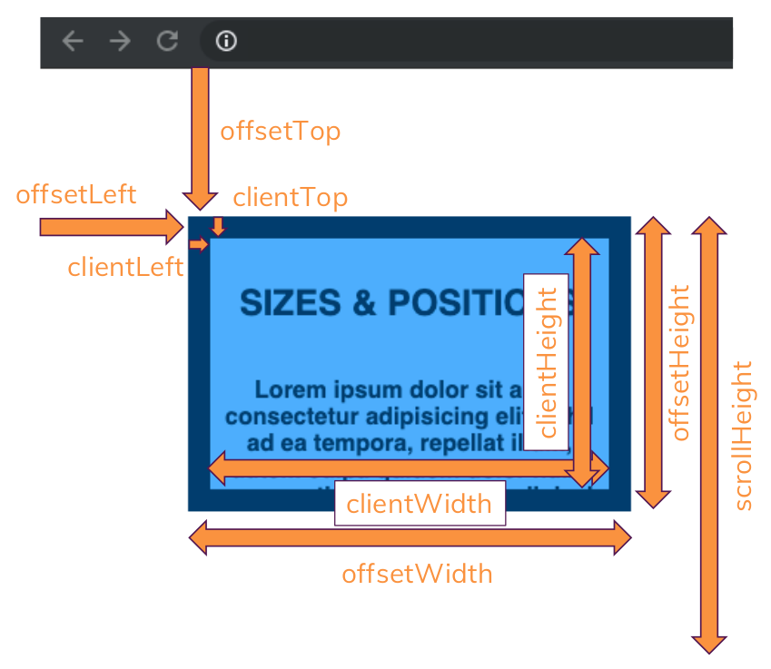

# Back to the DOM & More Browser APIs

- The `data-..` attribute in general is a special attribute that you can add to your own elements to attach any kind of data to them (e.g. `data-id` or `data-whatever`). These `data-..` attributes are all merged together in a dataset property. For example:

    ```html
    <!DOCTYPE html>
    <html lang="en">

    <head>
        <meta charset="UTF-8">
        <meta name="viewport" content="width=device-width, initial-scale=1.0">
    <title>Hamed</title>
    </head>

    <body>
        <div id="name" data-first-name="Hamed"></div>
        <script>
            const element = document.getElementById("name");
            console.log(element.dataset);
            /*
            DOMStringMap {firstName: "Hamed"}
              -> firstName: "Hamed"
              -> __proto__: DOMStringMap
            */
        </script>
    </body>

    </html>
    ```

    As you can see the naming is automatically converted to camel case (`firstName`). You can also add a `dataset` dynamically. For example:

    ```js
    const element = document.getElementById("element");

    element.dataset.firstName = "Hamed";
    element.dataset.lastName = "Alavi";
    element.dataset.age = 23;

    console.log(element.dataset);
    /*
    DOMStringMap {firstName: "Hamed", lastName: "Alavi", age: 23}
      -> firstName: "Hamed"
      -> lastName: "Hamed"
      -> age: 23
      -> __proto__: DOMStringMap
    */
    ```

- The `getBoundingClientRect()` method returns the size of an element and its position relative to the viewport. For example:

    ```js
    const element = document.getElementById("element");
    const domRect = element.getBoundingClientRect();

    console.log(domRect);
    /*
    DOMRect {x: 0, y: 0, width: 1536, height: 515.2000122070312, top: 0, …}
      -> bottom: 515.2000122070312
      -> height: 515.2000122070312
      -> left: 0
      -> right: 1536
      -> top: 0
      -> width: 1536
      -> x: 0
      -> y: 0
      -> __proto__: DOMRect
    */
    console.log(domRect.right); // 1536

    // === Look at the image below ===
    ```

    

- The `offsetTop` property returns the top position (in pixels) relative to the top of the `offsetParent` element. So `offsetTop` always is relative to your document start, **not** to the viewport (i.e. it does not change upon scrolling). For exmaple:

    ```js
    const element = document.getElementById("element");
    const offsetTop = element.offsetTop;

    console.log(offsetTop); // 100
    ```

    You also have `offsetLeft`, `offsetHeight` and `offsetWidth` property.
- The `clientTop` property returns the width of the top border of an element, in pixels. This property does not include the element's top padding or top margin. For example:

    ```js
    const element = document.getElementById("element");
    const clientTop = element.clientTop;

    console.log(clientTop); // 15
    ```

    You also have `clientLeft`, `clientHeight` and `clientWidth` property.
- You can get the scroll height with `scrollHeight` property. For example:

    ```js
    const div = document.getElementById("my-div");

    console.log(div.scrollHeight); // 410
    ```

- The `scrollTop` property gets or sets the number of pixels that an element's content is scrolled vertically. An element's `scrollTop` value is a measurement of the distance from the element's top to its topmost visible content. When an element's content does not generate a vertical scrollbar, then its scrollTop value is 0. For example:

    ```js
    const element = document.getElementById("element");

    console.log(element.scrollTop); // 0
    // If I scroll the content all the way to the bottom
    console.log(element.scrollTop); // 240
    ```

    You also have `scrollLeft` property (for horizontal scrolling).
- You can see the summary of element's size and position here:

    

- You can get the entire document width and height with `window.innerWidth` and `window.innerHeight` properties. But the problem with that is that if you had a visible scroll bar (e.g. on Internet Explorer), then this will actually include the scroll bar and not subtract it from width and height and therefore give you more width and height than you actually have available for your content. Hence a better way of getting the real available width and height is using `document.documentElement.clientWidth` and `document.documentElement.clientHeight`. For example:

    ```js
    console.log(window.innerWidth); // 1920
    console.log(document.documentElement.clientWidth); // 1905
    ```

- The `scrollTo(..)` method scrolls to a particular set of coordinates inside a given element. It takes two arguments for x coordinate and y coordinate. For example:

    ```js
    const div = document.getElementById("div");

    div.scrollTo(0, 100);
    ```

    You can also not just scroll to absolute values, you can also scroll relatively with `scrollBy(..)` method. With `scrollBy(..)` I tell **JavaScript** by how many pixels I want to scroll down. For example:

    ```js
    const div = document.getElementById("div");

    console.log(div.scrollTop); // 0
    div.scrollBy(0, 50);
    div.scrollBy(0, 50);
    console.log(div.scrollTop); // 100
    ```

    You can also pass an object as an argument to `scrollBy(..)` or `scrollTo()`. For example:

    ```js
    const div = document.getElementById("div");

    div.scrollBy({ top: 50, behavior: "smooth" });
    ```

- The `scrollIntoView()` method scrolls the specified element into the visible area of the browser window. For example:

    ```js
    const div = document.getElementById("div");

    div.scrollIntoView();
    ```

- The `<template>` tag content's by default is not rendered, but it's part of the DOM, so you can query and use it or use it in your **JavaScript** code.
- You can create and run a script with **JavaScript**. For example:

    ```js
    const someScript = document.createElement("script");

    someScript.textContent = "alert('Hi there!')";
    someScript.defer = true;
    document.head.append(someScript);
    ```

- The `setTimeout(..)` method calls a function or evaluates an expression after a specified number of milliseconds. When the timer is set, it will not pause your entire script execution (asynchronous), so you will be able to click all buttons and have your script to work as expected, instead this is registered by the browser somewhere in the background, the browser manages the timer and also just registers that function should be called when the timer expried and then once the brower sees that the timer expried, it will come back to your script and execute this function for you. For example:

    ```js
    const printName = () => {
        console.log("My name is Hamed");
    };

    setTimeout(printName, 3000);
    // === after 3 seconds ===
    // My name is Hamed
    ```

    You can also cancel a timeout function with `clearTimeout(..)` method. For example:

    ```js
    const printName = () => {
        console.log("My name is Hamed");
    };
    const timeout = setTimeout(printName, 3000);

    clearTimeout(timeout);
    // === nothing will be printed ==
    ```

- The `setInterval(..)` method, repeatedly calls a function or executes a code snippet, with a fixed time delay between each call. It returns an interval ID which uniquely identifies the interval, so you can remove it later by calling `clearInterval(..)`. For example:

    ```js
    let counter = 1;
    const printName = () => {
        console.log("My name is Hamed");
        if (counter === 3) {
            clearInterval(interval);
        }
        counter++;
    };

    const interval = setInterval(printName, 2000);
    // === after 2 seconds ===
    // My name is Hamed
    // === after 2 seconds ===
    // My name is Hamed
    // === after 2 seconds ===
    // My name is Hamed
    ```
