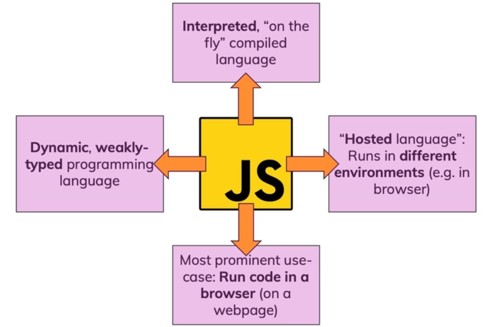
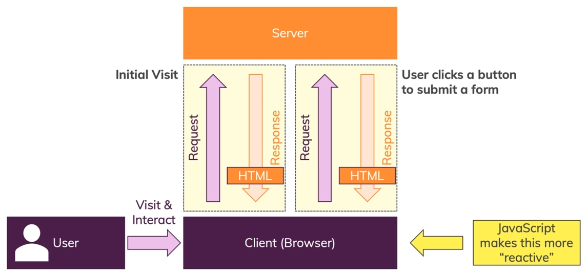
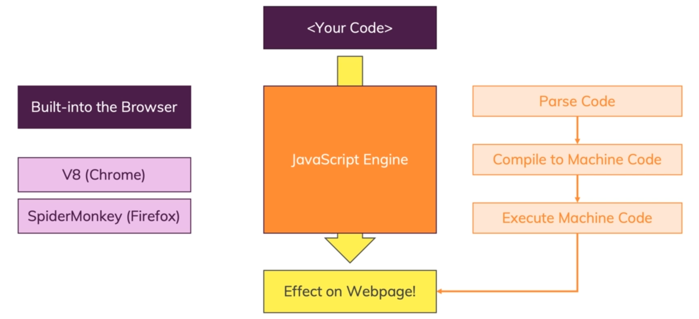

# Introduction

## What is **JavaScript**

- **JavaScript** is a dynamic, weakly typed programming language which is compiled at runtime. It can be executed as part of a webpage in a browser or directly on any machine (host environment).
- **JavaScript** was created to make webpages more dynamic (e.g. change content on a page directly from inside the brower). Originally, it was called **LiveScript** but duo to popularity of **Java**, it was renamed to **JavaScript**.
- **JavaScript** is totally independent from **Java** and has nothing in common with **Java** (like car and carpet).
- All modern website uses **JavaScript**.
- `.js` is the **JavaScript** files extension.
- **JavaScript** is an interpreted, **on the fly** compiled language.

## How Do Webpages Work

## How **JavaScript** Is Executed

- All these operations happens on a single thread.

## Dynamic and Weakly Typed Languages

- In **JavaScript** code can change at runtime (e.g. type of a variable).
- Data types are assumed (e.g. assigned to variables) automatically.
- You don't define that some variable has to hold a certain value (e.g. a number).
- Data types are not set in stone but can change.

## **JavaScript** Runs On A Host Environment

- Brower-side:
  - **JavaScript** was invented to create more dynamic websites by executing in the browser.
  - **JavaScript** can manipulate the HTML code, CSS, send background http requests and much more.
  - **JavaScript** can't access the local file system, interact with the operating system, and etc.
- Server-side:
  - Google's **JavaScript Engine** (V8) was extracted to run **JavaScript** anywhere (called **Node.js**, **Deno**, and etc).
  - **Node.js** can be executed on any machine and its therefore often used to build we backends (server-side **JavaScript**).
  - **Node.js** can access the local filesystem, interact with the operating system, and etc. It can't manipulate HTML or CSS.

## Difference Between **Java** and **JavaScript**

- **Java** doesn't (can't) run in a browser.
- **Java** is an object-oriented and strongly type language.
- All syntax, concepts, core features, and etc in **JavaScript** environments are same.
